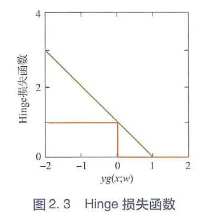
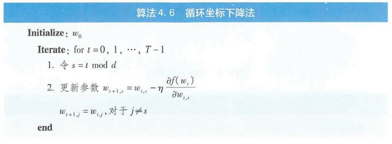
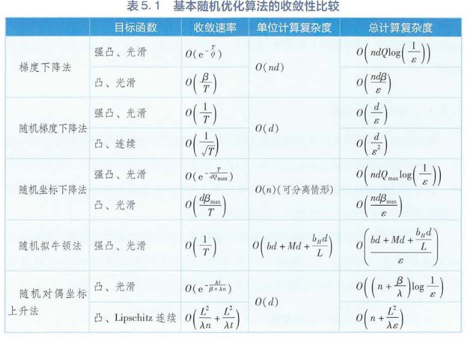
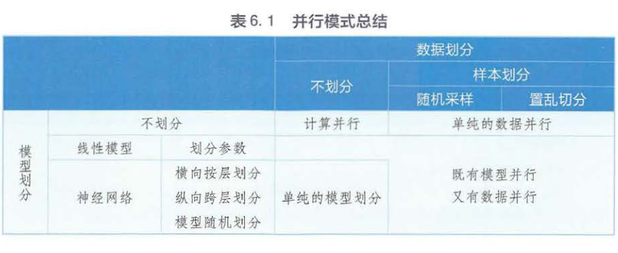
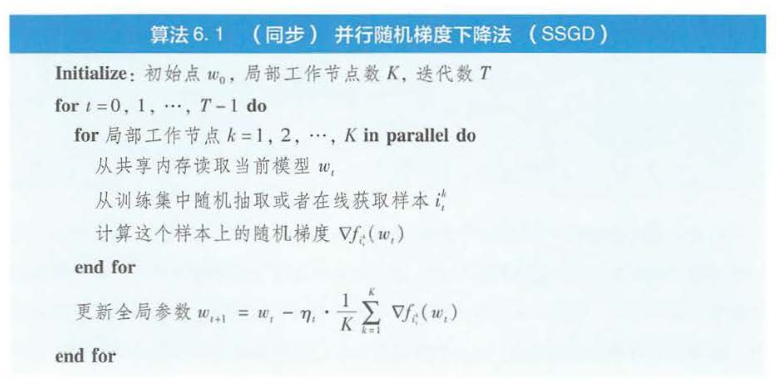

# 分布式机器学习

## 第一章 绪论
### 1.1 人工智能及其飞速发展
None

### 1.2 大规模、分布式机器学习
None

### 1.3 本书的安排
None

## 第二章 机器学习基础
### 2.1 机器学习的基本概念
None

### 2.2 机器学习的基本流程
None

### 2.3 常用的损失函数
#### 2.3.1 Hinge 损失函数
$l(w;x,y)=max[0,1-yg(x;w)], y\in \{1,-1\}$

Hinge函数的0点不可导。
#### 2.3.2 指数损失函数
$l(w;x,y)=exp(-yg(x;w)), y\in \{1,-1\}$

对符号不一致的情况惩罚力度更大（指数力度vs.线性力度），完全连续可导的凸函数。

### 2.4 常用的机器学习模型
#### 2.4.1 线性模型
广义线性函数：有一个线性函数派生出来的非线性函数，例如逻辑回归的线性函数通过了sigmoid。

#### 2.4.2 核方法与支持向量机
多项式核： $k(x_i,x_j)=(x_i^T,x_j)^P,P>=1$

高斯核：$k(x_i,x_j)=exp(\frac{-||x_i-x_j||^2}{2\sigma^2})$

拉普拉斯核：$k(x_i,x_j)=exp(\frac{-||x_i-x_j||}{\sigma}),\sigma>0$

Sigmoid核：$k(x_i,x_j)=tanh(\beta x_i^Tx_j+\theta),\beta>0,\theta<0$

#### 2.4.3 决策树与Boosting
None

#### 2.4.4 神经网络
None

### 2.5 常规优化方法

一阶方法：优化过程中只利用了目标函数的一阶导数信息。
二阶方法：优化过程中要利用到目标函数的二阶导数信息。

### 2.6 机器学习理论
#### 2.6.1 机器学习算法的泛化误差
None

#### 2.6.2 泛化误差的分解
估计模型：$L(\hat g_r)$

最优模型：$L(\hat g^*)$

函数族$\zeta$中使得期望风险最小的模型：$g_\zeta^*=\argmin\limits_{g\in\zeta}L(g)$

函数族$\zeta$中使得经验风险最小的模型：$g_n^*=\argmin\limits_{g\in\zeta}\hat l_n(g)$

优化误差：$L(\hat g_r)-(\hat g_n)$，模型与最小化经验风险模型之间的误差，是迭代轮数决定的。

估计误差：$L(\hat g_n)-L(g_\zeta^*)$，最小化经验风险模型与精确最小化经验风险模型之间的误差，是数据子造成的。

近似误差：$L(g_\zeta^*)-L(g^*)$，函数集合$\zeta$中的最优期望风险与全局最优期望风险的误差，与函数空间大小有关。

泛化误差：$L(\hat g_r)-L(g^*)=L(\hat g_r)-(\hat g_n)+L(\hat g_n)-L(g_\zeta^*)+L(g_\zeta^*)-L(g^*)$

#### 2.6.3 基于容度的估计误差的上界
None

### 2.7 总结
None

## 第三章 分布式机器学习框架
### 3.1 大数据与大模型的挑战
None

### 3.2 分布式机器学习的基本流程
原因：计算量大，训练数据多，模型规模大。

计算量大：基于共享内存的多线程或多机并行。

训练数据太多：将数据进行划分，分配到多个工作节点上进行训练。

模型规模大：对模型进行划分，分配到不同的工作节点上训练。通信延迟敏感。

### 3.3 数据与模型划分模块
对训练样本划分：基于随机采样的方法，基于置乱切分的方法，对特征维度进行划分。

基于随机采样的方法：优点——有放回的随机采样，按照每个工作节点的容量为其分配相应数目的训练样本。目的是保证局部训练与原训练独立同分布。缺点——数据量大，全局采样成本高，低频样本难以出现。

基于置乱切分的方法：将数据乱序排列，按照工作节点容量切分成小份，随即将数据分配到各个节点。一个完整的训练周期结束后将局部数据打乱一次，一定阶段以后全局打乱。目的是保证独立同分布。

对特征维度进行划分：将$d$维的特征向量划分为$K$份，然后把特征分配到$K$个工作节点上。要与特定的优化方法配合如坐标下降法。

对模型划分：横向划分，纵向划分,随机划分。

横向划分：层与层之间划分，层之间需要参数通信，有的层参数较多，节点可能无法承载。

纵向划分：将模型划分成多份，模型之间的依赖关系会更复杂，通信代价也会更高。

随机划分：骨架网络是比原模型更小的网络，也能达到相似的拟合效果。把骨架网络存储与各个工作节点，各个工作节点相互通信的时候还会随机传输一些属于非骨架网络的神经元参数，从而起到探索原网络全局拓扑结构的作用。

### 3.4 单机优化模块
None

### 3.5 通信模块
#### 3.5.1 通信的内容
 None

#### 3.5.2 通信的拓扑结构
1. 基于迭代式MapReduce/AllReduce的通信拓扑

完全利用内存实现，引入了永久性存储。但是只能在所有Mapper完成任务以后才进入Reduce过程。另外需要大量改动原程序。

2. 基于参数服务器的通信拓扑

参数服务器存储发放参数，工作节点负责训练和发回参数服务器。参数服务器和工作节点隔离，工作节点不需要时刻同步。模型参数被划分到多个服务器上，因此可以存储较大的模型，并且负载平衡提高通信效率。

3. 基于数据流的通信拓扑

Tensorflow

#### 3.5.3 通信的步调
同步通信：优点——逻辑清晰，理论有所保障。缺点——计算节点性能不匹配，较慢的节点会产生木桶效应，部分节点损坏会造成任务失败。

异步通信：本地模型不需要等待其他节点，将自己的训练结果上传至参数服务器，继续本地的训练。异步通信分为有锁和无锁两种。

有锁：局部信息写入全局模型时，会通过加锁保证数据写入的完整性，缺点是限制参数更新的吞吐量。

无锁：局部写入全局不保证完整性，换取更高的吞吐量。

延迟：更新速度快的节点受到更新速度慢的结点的拖累，影响了全局收敛的速度。

半同步通信：设置阈值，当快慢不同的节点更新轮数在阈值范围内，快慢节点自由发挥。当更新轮数在阈值范围外时，快节点等待慢节点。

#### 3.5.4 通信的频率
None

### 3.6 数据与模型聚合模块
None

### 3.7 分布式机器学习理论
分布式机器学习讨论的几个指标：收敛性，加速比，泛化性。

### 3.8 分布式机器学习系统
基于迭代器MapReduce的机器学习系统————Spark MLlib

基于参数服务器的机器学习系统————Multiverso

基于数据流的机器学习系统————Tensorflow

优缺点：

I. 灵活性：MapReduce灵活性最低，需要满足Map+Reduce步骤；参数服务器灵活性最高，它只提供全局存储；数据流系统灵活性中等，任务需要描述成DAG形式。

II. 运行效率：基于MapReduce的系统时同步系统，效率最低；基于参数服务器和数据流的系统都支持异步通信。

III. 处理任务角度：基于MapReduce的机器学习系统支持浅层模型如逻辑回归、LDA、矩阵分解等；Tensorflow提供了很多矩阵运算的算子和优化器，可以搭建深度学习模型；基于参数服务器的系统可以支持所有类型服务。

IV. 用户使用角度：Spark MLlib和Tensorflow更完善一些，Multiverso较薄弱。

### 3.9 总结

## 第四章 单机优化之确定性算法
### 4.1 基本概述
#### 4.1.1 机器学习的优化框架
$T$是迭代步数，$w_r$是输出模型权重，$w^*$是最优模型权重。有表达式$E||w_r-w^*||^2\leq\epsilon(T)$，当$\epsilon(T)\rightarrow0$，我们称优化算法是收敛的。

用$log\epsilon(T)$来定义收敛速率：

I. $log\epsilon(T)$与$-T$同阶，则线性收敛速率。
II. 若前者慢于后者，则称为次线性收敛速率。
III. 若前者快于后者，则称为超线性收敛速率。若$loglog\epsilon(T)$与$-T$同阶，则称为二阶收敛速率。

凸函数：任何一处的阶大于等于1且最高阶系数大于0的函数。

强突函数：任何一处最高阶都大于等于2次的凸函数。
### 4.2 一阶确定性算法
#### 4.2.1 梯度下降法
梯度的方向：沿函数值增大的方向。

I：当目标函数是强凸函数时，梯度下降的收敛速率是线性的；目标函数是凸函数，收敛速度是次线性的。

II：在强凸情况下光滑性质越强收敛越快，对凸函数来说，光滑性质越差收敛越快。

#### 4.2.2 投影次梯度下降法
梯度下降缺点：无法适用于约束优化问题，梯度不存在时无法优化。

次梯度：不可导的点具有多个梯度，这些梯度的集合被称为次梯度集，每一个梯度被称为次梯度。

投影次梯度下降法：随机选取一个次梯度作为更新的梯度，更新结束后查看是否属于约束域，若不属于则寻找约束域内的最近的点。

#### 4.2.3 近端梯度下降法
对于凸优化问题，当其目标函数存在不可微部分（例如l1范数）时，近端梯度下降法才会派上用场。

公式暂时看不懂，先放着！！！！！！！！！！！！！！！！！！！！！！！

#### 4.2.4 Frank-Wolfe算法
不同于投影法先梯度下降再对约束投影，该算法在目标函数泰勒展开时就考虑了约束。目的是避免投影计算过于复杂。
$v_t=\argmin\limits_{v\in W}f(w_t)+\nabla f(w_t)^T(v-w_t)=\argmin\limits_{v\in W}\nabla f(w_t)^Tv$

公式暂时看不懂，先放着！！！！！！！！！！！！！！！！！！！！！！！

#### 4.2.5 Nesterov加速法
公式暂时看不懂，先放着！！！！！！！！！！！！！！！！！！！！！！！

#### 4.2.6 坐标下降法
每次迭代算法选择一个维度，其他维度参数保持不变。

### 4.3 二阶确定性算法
#### 4.3.1 牛顿法
对目标函数二阶泰勒展开，最小化这个目标函数

$\min\limits_{w\in W}f(w)\approx \min\limits_{w\in W}f(w_t)+\nabla f(w_t)^T(w-w_t)+\frac{1}{2}(w-w_t)^T\nabla^2 f(w_t)(w-w_t)$

如果目标函数在当前状态$w_t$处的海森矩阵$\nabla^2 f(w_t)$是正定的，则：

$w_{t+1}=w_t-[\nabla^2 f(w_t)]^{-1}\nabla f(w_t)$

二阶的牛顿法提供了更加精细的步长调节，因此收敛速度更快，具有二次收敛速率。$||w_r-w^*||\leq O(e^{-2T})$

缺点：海森矩阵计算量巨大，海森矩阵不一定正定。

#### 4.3.2 拟牛顿法
构造与非正定矩阵相距不太远的正定矩阵，然后使用牛顿法。

公式暂时看不懂，先放着！！！！！！！！！！！！！！！！！！！！！！！

### 4.4 对偶方法
公式暂时看不懂，先放着！！！！！！！！！！！！！！！！！！！！！！！

### 4.5 总结
None

## 第五章 单机优化之随机算法
### 5.1 基本随即优化算法
#### 5.1.1 随机梯度下降法
None

#### 5.1.2 随机坐标下降法
公式暂时看不懂，先放着！！！！！！！！！！！！！！！！！！！！！！！

#### 5.1.3 随机拟牛顿法
公式暂时看不懂，先放着！！！！！！！！！！！！！！！！！！！！！！！

#### 5.1.4 随机对偶坐标上升法
公式暂时看不懂，先放着！！！！！！！！！！！！！！！！！！！！！！！

#### 5.1.5 小结

结论：

1) 当数据量较大时，随机梯度下降法比梯度下降法更高效。
2) 如果目标函数时可分离的，随机坐标下降法比梯度下降法更高效。
3) 如果目标函数时可分离的，并且数据维度较高，随机坐标下降法比随机梯度下降法更高效。
4) 随机拟牛顿法的效率和随机梯度下降法的效率相同。
   
### 5.2 随即优化算法的改进
#### 5.2.1 方差缩减法
1. 随机方差缩减梯度法(SVRG)、随即平均梯度法(SAG)、加速随机平均梯度法(SAGA)。对随机梯度加入正则项，从而降低方差。
2. 。。。。

第五章先略过。

## 第六章 数据与模型并行
### 6.1 基本概述
1. 计算并行模式：计算节点公用公共内存，数据和模型存储于共享内存中。计算节点并行地执行优化算法。
2. 数据并行模式：没有公共内存。
3. 模型并行模式：模型规模大，无法存储于本地内存。

### 6.2 计算并行模式

